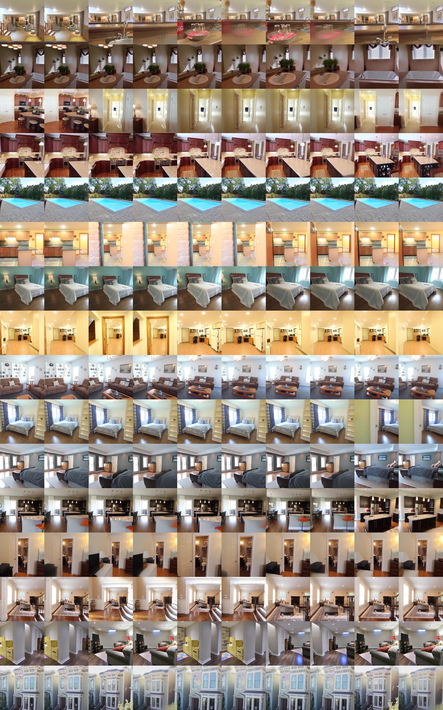
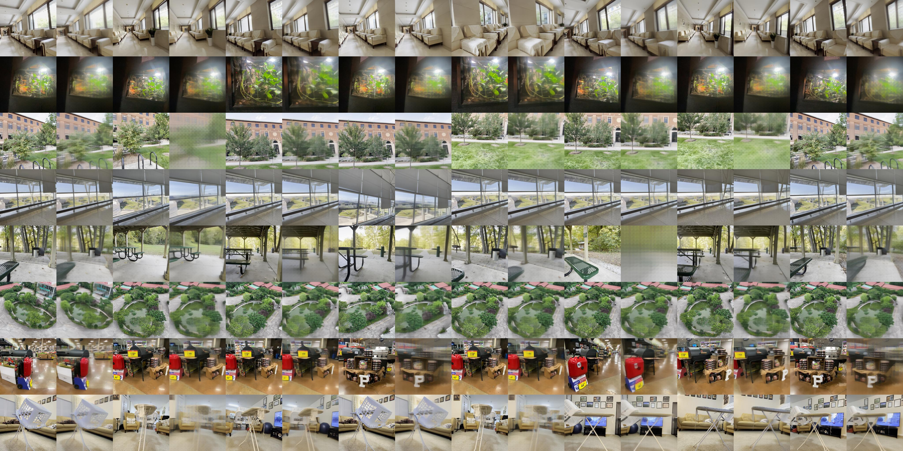
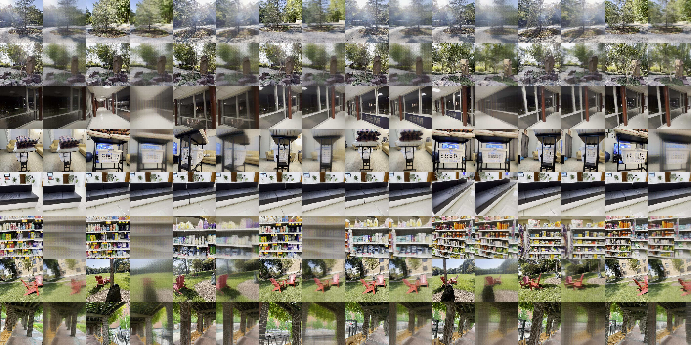

# Open-Rayzer: Self-Reimplemented Version of Rayzer

This repository contains a open-source Self-Reimplemented Version of the paper **"RayZer: A Self-supervised Large View Synthesis Model"**. For official implementation, please refer to [RayZer](https://github.com/hwjiang1510/RayZer) repository. 

Our current version remains under active development. As the reproduced results have not yet matched numbers reported in paper, we welcome any feedback, comments, and contributions from the community.


---

## Tentative TO-DO List

- [x] Sample config files
- [x] Config files for training on RealEstate10k and DL3DV
- [x] Release of pre-processed DL3DV chunks (~145 GB)
- [ ] Investigate and address the performance gap with the original paper

---


## 1. Environment

Create and activate conda environment:

```bash
conda create -n lvsm python=3.11
conda activate lvsm
pip install -r requirements.txt
```

*Recommended*: GPU device with compute capability > 8.0. We used 8*A100 GPUs in our experiments.

## 2. Dataset

We use RealEstate10K dataset from [pixelSplat](https://github.com/dcharatan/pixelsplat?tab=readme-ov-file#acquiring-datasets), and followed [LVSM](https://github.com/haian-jin/LVSM) to do the preprocessing. We also pack and preprocess DL3DV dataset into pixelSplat style, and release them [here](https://huggingface.co/datasets/littlekoyo/dl3dv-960P_chunked/blob/main/dl3dv_chunked.tar). For the 2 datasets, **please ensure compliance with the respective licensing agreements when downloading**. You need to first download and unzip the `.torch` chunks. After that, process the dataset with:

```bash
# process re10k training split
python process_data.py --base_path datasets/re10k --output_dir datasets/re10k-full_processed --mode train --num_processes 80

# process re10k test split
python process_data.py --base_path datasets/re10k --output_dir datasets/re10k-full_processed --mode test --num_processes 80

# process dl3dv splits
python process_data.py --base_path datasets/dl3dv --output_dir datasets/dl3dv-full_processed --mode 1K --num_processes 80
python process_data.py --base_path datasets/dl3dv --output_dir datasets/dl3dv-full_processed --mode 2K --num_processes 80
# ...
python process_data.py --base_path datasets/dl3dv --output_dir datasets/dl3dv-full_processed --mode 10K --num_processes 80   

```

## 3. Training

We follow the training settings described in the RayZer paper. For each dataset, we provide results from Rayzer and LVSM baselines.

```bash
# train lvsm baseline on re10k
torchrun --nproc_per_node 8 --nnodes 1 --rdzv_id 18640 --rdzv_backend c10d --rdzv_endpoint localhost:29511 -m src.train --config config/lvsm_re10k.yaml

# train lvsm baseline on dl3dv
torchrun --nproc_per_node 8 --nnodes 1 --rdzv_id 18640 --rdzv_backend c10d --rdzv_endpoint localhost:29511 -m src.train --config config/lvsm_dl3dv.yaml

# train rayzer on re10k
torchrun --nproc_per_node 8 --nnodes 1 --rdzv_id 18640 --rdzv_backend c10d --rdzv_endpoint localhost:29511 -m src.train --config config/rayzer_re10k.yaml

# train rayzer on dl3dv
torchrun --nproc_per_node 8 --nnodes 1 --rdzv_id 18640 --rdzv_backend c10d --rdzv_endpoint localhost:29511 -m src.train --config config/rayzer_dl3dv.yaml
```

## 4. Preliminary Results

| Model          |         re10k          |             |             |         dl3dv          |             |             |
|----------------|------------------------|-------------|-------------|------------------------|-------------|-------------|
|                | SSIM                   | PSNR        | LPIPS       | SSIM                   | PSNR        | LPIPS       |
| LVSM           | 0.822                  | 25.80       | 0.182       | 0.684                  | 23.12       | 0.282       |
| LVSM (paper)   | 0.828                  | 25.88       | 0.175       | 0.703                  | 23.10       | 0.257       |
| Rayzer (ours)  | 0.768                  | 24.30       | 0.212       | 0.562                  | 20.84       | 0.354       |
| Rayzer (paper) | 0.835                  | 26.32       | 0.164       | 0.733                  | 23.72       | 0.222       |

- **visualization on re10k**:


- **visualization on dl3dv**:



## 5. Disscussion

### Existing deviations from the paper

- **Positional encoding**: We use 2D-RoPE for patches and VGGT-style attention for images, rather than using "sinusoidal spatial p.e. and the sinusoidal image index p.e." from papar Sec. 4.2.
- **Camera head**: We adopt [Pi3](https://github.com/yyfz/Pi3) style permutation-equivariant extrinsics prediction head, instead of predicting rot6d from paper Sec. 4.2.  
- **View selection**: Currently, we haven't inplemented a view-selection warm-up strategy yet, which might be hindering the performance.
- **DL3DV split**: Since no official evaluation protocol/split was found, we're currently using 1K to 9K for training, and 10K for testing.

### Observations

- **Positional encoding**: Both 2D-RoPE and VGGT-style attention yield consistent improvements. These can be enabled in the configuration via `rope: True` and `vggstyle: True`.  
- **Token fusion**: For fusing feature tokens $f_A$ and $r_A$, pixel-level alignment achieves superior results compared to MLP-based feature fusion. This can be enabled by setting `fusion_strategy: "pixel_fuse"`.  
- **Image patchfier**: Using pretrained dinov3 as image patchfier yields inferior results than a simple linear layer, which is consistent with the paper. This can be enabled by setting `image_tokenizer.mode: "dinov3"` in the config.

## 📄 Acknowledgments

Our implementation builds upon [LVSM](https://github.com/haian-jin/LVSM) and [Less3Depend](https://github.com/ou524u/Less3Depend). We also thank to author of [Long-LRM](https://github.com/arthurhero/Long-LRM#) for providing DL3DV preprocessing scripts, and [Pi3](https://github.com/yyfz/Pi3) for their elegant codes.

If you are interested in how LVSM-stream methods developed and achieve success, we recommend a unique perspective in our paper **The Less You Depend, The More You Learn: Synthesizing Novel Views from Sparse, Unposed Images without Any 3D Knowledge**.
